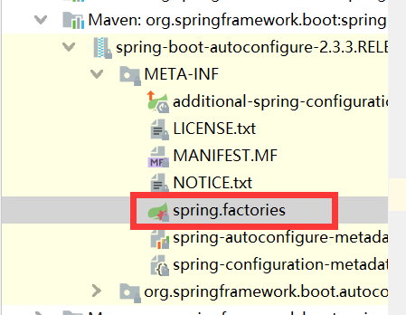
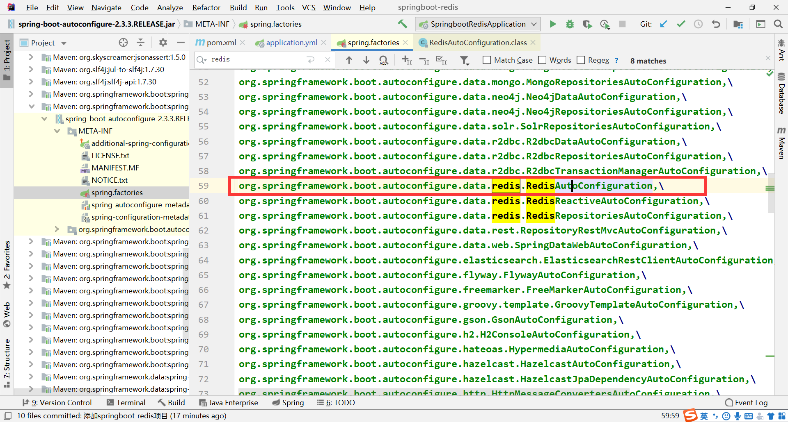
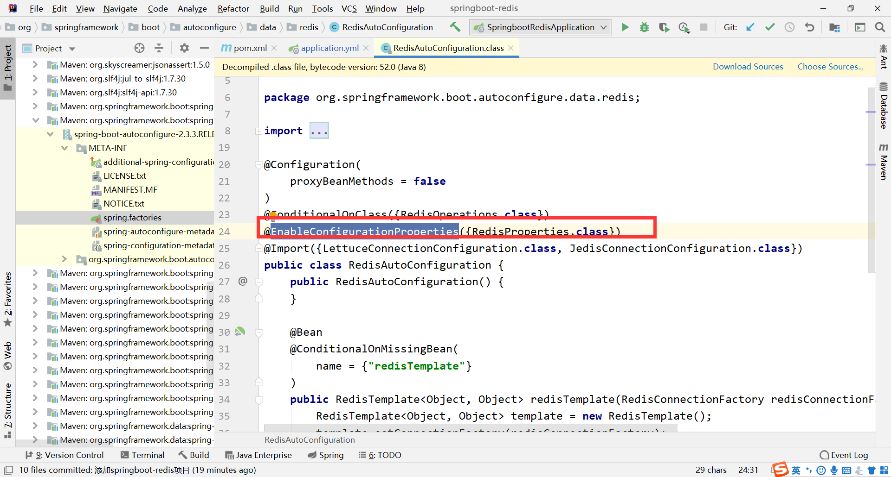
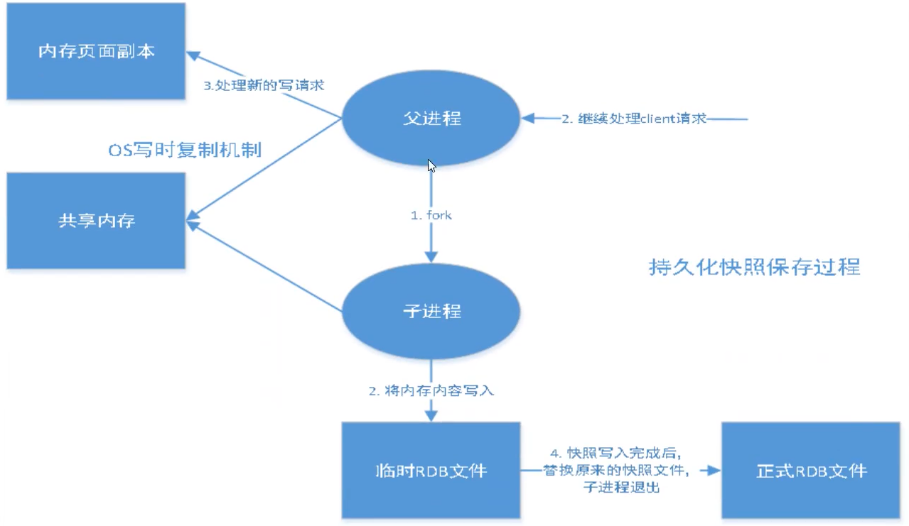
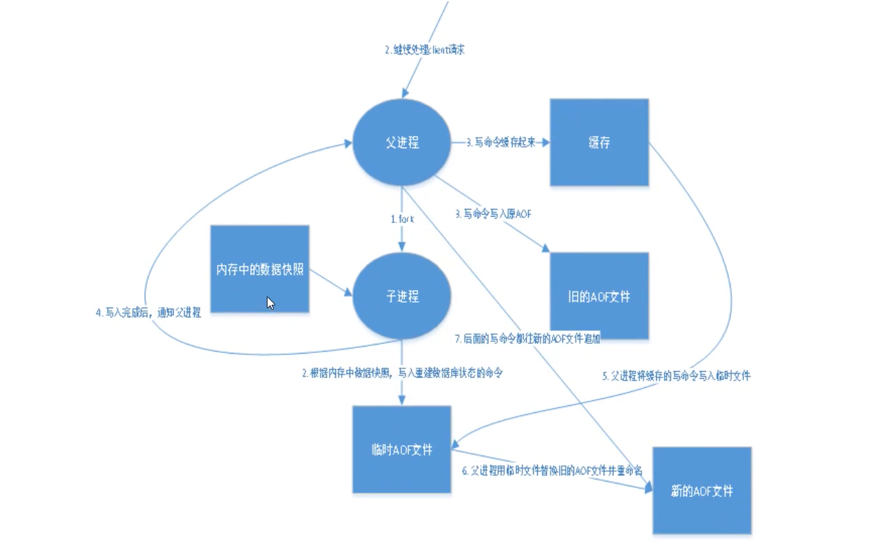
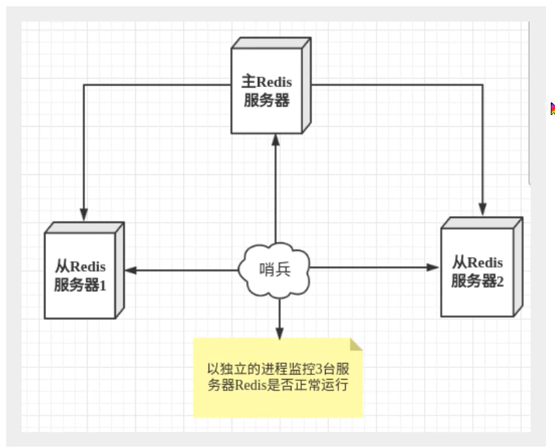
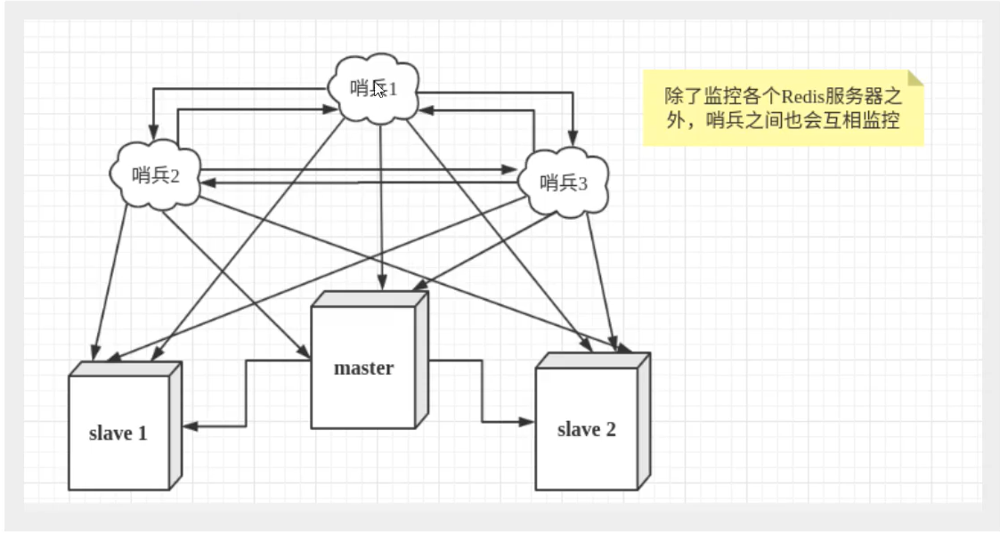
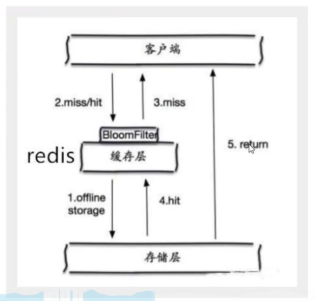
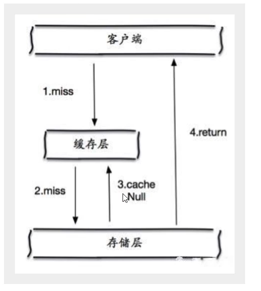

# Jedis

>什么是jedis，相当于jdbc，用来操作redis

### 导入相关依赖

```xml
<!-- https://mvnrepository.com/artifact/redis.clients/jedis -->
<dependency>
    <groupId>redis.clients</groupId>
    <artifactId>jedis</artifactId>
    <version>3.3.0</version>
</dependency>
<!-- fastjson -->
<dependency>
	<groupId>com.alibaba</groupId>
	<artifactId>fastjson</artifactId>
	<version>1.2.73</version>
</dependency>
```

注：据别人说fastjson有漏洞，工作中不建议使用

### 编码测试

>连接数据库

```java
//1.jedis对象 
Jedis jedis = new Jedis("192.168.177.197",6379);
jedis.auth("123456");
//redis默认是不允许远程连接的，如果要在程序中远程连接，需要将配置文件中bind *或bind 想访问redis的地址
//这里我增加了requirepass 123456 所以需要密码
```

>进行操作

```java
//测试连接
System.out.println(jedis.ping());//返回pong 表示测试成功
```

>更多的api操作不再演示，基本和命令行中的命令一样

### 事务的使用

```java
 		//1.jedis对象
        Jedis jedis = new Jedis("192.168.177.197",6379);
        jedis.auth("123456");
        //清空数据库
        jedis.flushDB();
        JSONObject jsonObject = new JSONObject();
        jsonObject.put("name","ydd");
        jsonObject.put("age", "28");
        //开启事务
        Transaction tx = jedis.multi();
        try {
            tx.set("user1", jsonObject.toJSONString());
            tx.set("user2", jsonObject.toJSONString());
            //执行事务
            tx.exec();
        } catch (Exception e) {
            e.printStackTrace();
            //放弃事务
            tx.discard();
        } finally {
            System.out.println(jedis.get("user1"));
            System.out.println(jedis.get("user2"));
            jedis.close();
        }
```

# springboot 整合redis

> 在springboot2.x之后原来的jedis被替换为了lettuce
>
> lettuce 使用netty，实例可以在多个线程间共享，不存在线程不安全的情况，可以减少线程数据了

### 如何查看springboot关于redis都有哪些配置？

> 首先找到autoconfigure.jar中的spring.factories



> 打开之后搜索redis，可以看到是哪个类自动配置了redis



> 打开类之后寻找springboot使用的哪个配置类来进行配置，点进配置类后就可以看到默认的属性配置和都有哪些可以配置



### 编码测试

> 配置数据库连接信息

```properties
#数据库信息
spring.redis.host=192.168.177.197
spring.redis.port=6379
spring.redis.password=123456
```

> 测试代码

```java
package com.max.springbootredis;

import org.junit.jupiter.api.Test;
import org.junit.runner.RunWith;
import org.springframework.beans.factory.annotation.Autowired;
import org.springframework.boot.test.context.SpringBootTest;
import org.springframework.data.redis.core.RedisTemplate;
import org.springframework.test.context.junit4.SpringRunner;

@SpringBootTest(classes=SpringbootRedisApplication.class)
@RunWith(SpringRunner.class)
class SpringbootRedisApplicationTests {

    @Autowired
    private RedisTemplate redisTemplate;

    @Test
    public void testRedisTemplate(){
        //操作各种类型要先opsForXXX.后面的方法和jedis差不多
        //opsForValue() 字符串
        //opsForList() list
        //opsForSet() set
        //opsForHash() hash
        //.... zset geo hyperloglog bitmap
        redisTemplate.opsForValue().set("name","max");
        //获取连接的操作
        //redisTemplate.getConnectionFactory().getConnection().flushDb();
    }
}
```

> 自定义RedisTemplate

```java
package com.max.springbootredis.config;

import com.fasterxml.jackson.annotation.JsonAutoDetect;
import com.fasterxml.jackson.annotation.PropertyAccessor;
import com.fasterxml.jackson.databind.ObjectMapper;
import org.springframework.context.annotation.Bean;
import org.springframework.context.annotation.Configuration;
import org.springframework.data.redis.connection.RedisConnectionFactory;
import org.springframework.data.redis.core.RedisTemplate;
import org.springframework.data.redis.serializer.Jackson2JsonRedisSerializer;
import org.springframework.data.redis.serializer.StringRedisSerializer;

import java.net.UnknownHostException;

@Configuration
public class RedisConfig {

    @Bean
    public RedisTemplate<String, Object> redisTemplate(RedisConnectionFactory redisConnectionFactory) throws UnknownHostException {
        RedisTemplate<String, Object> template = new RedisTemplate();
        template.setConnectionFactory(redisConnectionFactory);

        //配置具体的序列化方式
        Jackson2JsonRedisSerializer jackson2JsonRedisSerializer = new 
        Jackson2JsonRedisSerializer(Object.class);
        ObjectMapper om = new ObjectMapper();
        om.setVisibility(PropertyAccessor.ALL, JsonAutoDetect.Visibility.ANY);
        om.enableDefaultTyping(ObjectMapper.DefaultTyping.NON_FINAL);
        jackson2JsonRedisSerializer.setObjectMapper(om);
        StringRedisSerializer stringRedisSerializer = new StringRedisSerializer();

        //普通key和hash的key的序列化
        template.setKeySerializer(stringRedisSerializer);
        template.setHashKeySerializer(stringRedisSerializer);
        //普通value和hash的value的序列化
        template.setValueSerializer(jackson2JsonRedisSerializer);
        template.setHashValueSerializer(jackson2JsonRedisSerializer);
        template.afterPropertiesSet();
        return template;
    }
}

```

### 小结

> 实际工作中我们并不需要一遍遍的写原生的api，我们可以使用一个工具类将其封装起来，以便我们使用

# redis 配置文件详解

```properties
# units are case insensitive so 1GB 1Gb 1gB are all the same.配置文件中的单位是不区分大小写的
################################## INCLUDES ###################################
# include /path/to/local.conf
# include /path/to/other.conf
# 一个redis配置文件中可以包含多个配置文件进行组合，类似spring配置文件中的包含
################################## NETWORK #####################################
# bind 127.0.0.1 允许访问的ip，如果要可以进行远程访问 可以使用*号
# port 6379 redis的端口号
# protected-mode yes 保护模式
# 下面的一些配置都是关于tcp的，反正也不懂略过
################################# GENERAL #####################################
# daemonize yes 以守护进程的方式运行(后台运行)，默认是no，需要改为yes
# supervised no 管理守护进程用的，一般不用动
# pidfile /var/run/redis_6379.pid 如果以后台方式运行，我们需要指定一个pid文件

# Specify the server verbosity level.
# This can be one of:
# debug (a lot of information, useful for development/testing)
# verbose (many rarely useful info, but not a mess like the debug level)
# notice (moderately verbose, what you want in production probably)
# warning (only very important / critical messages are logged)
# loglevel notice 日志级别，基本不用改

# logfile "" 生成的日志文件的名字
# databases 16 数据库的个数
# always-show-logo yes 是否显示redis的logo
################################ SNAPSHOTTING  ################################
# 这里的配置都是关于持久化的
# 含义解释：在规定的时间内，进行了多少次操作，则会持久化到文件，rdb、aof后面说
# save 900 1 900秒内至少1个key进行改变，则进行持久化，下面两个类似
# save 300 10
# save 60 10000
# stop-writes-on-bgsave-error yes 持久化出错之后是否继续写入工作
# rdbcompression yes 是否压缩rdb文件，需要消耗一些cpu资源
# rdbchecksum yes 是否校验rdb文件，同理也可能会消耗一些cpu资源
# dir ./ 持久化文件的保存目录
################################# REPLICATION #################################
# 主从复制相关配置，这里先不说，后面进行主从复制再来看
################################## SECURITY ###################################
# requirepass 123456 设置redis密码，一般不在配置文件中做，而是通过命令行，config set requirepass 密码的方式
################################### CLIENTS ####################################
# maxclients 10000 限制能连接上redis的最大客户端数量，
############################## MEMORY MANAGEMENT ################################
# 内存管理
# maxmemory <bytes> redis设置的最大内存容量

# MAXMEMORY POLICY: how Redis will select what to remove when maxmemory
# is reached. You can select one from the following behaviors:
#
# volatile-lru -> Evict using approximated LRU, only keys with an expire set.
# allkeys-lru -> Evict any key using approximated LRU.
# volatile-lfu -> Evict using approximated LFU, only keys with an expire set.
# allkeys-lfu -> Evict any key using approximated LFU.
# volatile-random -> Remove a random key having an expire set.
# allkeys-random -> Remove a random key, any key.
# volatile-ttl -> Remove the key with the nearest expire time (minor TTL)
# noeviction -> Don't evict anything, just return an error on write operations.
#
# LRU means Least Recently Used
# LFU means Least Frequently Used
#
# Both LRU, LFU and volatile-ttl are implemented using approximated
# randomized algorithms.
# maxmemory-policy noeviction 内存到达上限的处理策略
############################## APPEND ONLY MODE ###############################
# aof的配置
# appendonly no 是否开启aof模式 默认是不开启的 默认是rdb的方式进行持久化的，在大部分情况下完全够用
# appendfilename "appendonly.aof" aof持久化的文件的名字

# appendfsync always 每次修改都会同步，消耗性能
# appendfsync everysec 每秒执行一次，可能会丢失1秒的数据
# appendfsync no 不执行，相当于关闭
# 具体配置在redis持久化中详细说明

```

# redis的持久化

### RDB(redis database)

> redis会单独创建一个子线程来进行持久化，会先将数据写入到一个临时文件，待持久化过程都结束了，再用这个临时文件替换上一次持久化好的文件。整个过程中，redis主进程是不进行任何IO操作的，这就确保了极高的性能。如果需要进行大量数据的恢复，但对于数据恢复的敏感性不是非常高，那RDB方式要比AOF方式效率高。RDB的缺点是最后一次持久化后的数据有可能丢失。Redis默认就是使用RDB进行持久化，一般情况下不需要修改这个配置。

RDB的流程示意图



> RDB的触发机制

- 在主从复制场景下，如果从节点执行全量复制操作，则主节点会执行bgsave命令，并将rdb文件发送给从节点；

- 执行shutdown命令时，自动执行rdb持久化，如下图所示：

- 自动触发，最常见的情况是在配置文件中通过save m n，指定当m秒内发生n次变化时，会触发bgsave。

> 如何自动回复RDB文件

- 将.rdb文件放在配置文件指定的dir目录位置，在redis启动时就会自动加载.rdb中的数据

> RDB的优点

- RDB是一个紧凑压缩的二进制文件，代表Redis在某个时间点上的数据快照。非常适用于备份，全量复制等场景。比如每6个小时执行bgsave备份，并把RDB文件拷贝到远程机器或者文件系统中（如hdfs），用于灾难恢复。
- Redis加载RDB恢复数据远远快于AOF的方式。

> RDB的缺点

- RDB方式数据没办法做到实时持久化/秒级持久化。因为bgsave每次运行都要执行fork操作创建子进程，属于重量级操作，频繁执行成本过高。
- RDB文件使用特定二进制格式保存，Redis版本演进过程中有多个格式的RDB版本，存在老版本Redis服务无法兼容新版RDB格式的问题。
- 如果想要在Redis故障时，尽可能少的丢失数据，那么RDB没有AOF好。

### AOF(append only file)

> 以日志的形式，来记录每个写操作。将redis执行过的所有指令记录下来，只许追加文件但不许改写文件，redis启动之初会重新读取该文件重新构建数据。

AOF流程示意图



> AOF的其他配置

```properties
# auto-aof-rewrite-percentage 100 自动重写的配置
# auto-aof-rewrite-min-size 64mb 
```

> redis-check-aof修复aof文件

如果aof文件有错误，那么redis是启动不起来的，我们需要修复aof文件

> AOF的优点

- 该机制可以带来更高的数据安全性，即数据持久性。Redis中提供了3中同步策略，即每秒同步、每修改同步和不同步。事实上，每秒同步也是异步完成的，其效率也是非常高的，所差的是一旦系统出现宕机现象，那么这一秒钟之内修改的数据将会丢失。而每修改同步，我们可以将其视为同步持久化，即每次发生的数据变化都会被立即记录到磁盘中。可以预见，这种方式在效率上是最低的。至于无同步，无需多言，我想大家都能正确的理解它
- 由于该机制对日志文件的写入操作采用的是append模式，因此在写入过程中即使出现宕机现象，也不会破坏日志文件中已经存在的内容。然而如果我们本次操作只是写入了一半数据就出现了系统崩溃问题，不用担心，在Redis下一次启动之前，我们可以通过redis-check-aof工具来帮助我们解决数据一致性的问题。
- 如果日志过大，Redis可以自动启用rewrite机制。即Redis以append模式不断的将修改数据写入到老的磁盘文件中，同时Redis还会创建一个新的文件用于记录此期间有哪些修改命令被执行。因此在进行rewrite切换时可以更好的保证数据安全性。
-  AOF包含一个格式清晰、易于理解的日志文件用于记录所有的修改操作。事实上，我们也可以通过该文件完成数据的重建。

> AOF的缺点

- 对于相同数量的数据集而言，AOF文件通常要大于RDB文件。RDB 在恢复大数据集时的速度比 AOF 的恢复速度要快。
- 根据同步策略的不同，AOF在运行效率上往往会慢于RDB。总之，每秒同步策略的效率是比较高的，同步禁用策略的效率和RDB一样高效。

# Redis发布订阅

> 相当于RabbitMQ中的广播模型

# Redis主从复制

> 主从复制，是指将一台redis服务器的数据，复制到其他redis服务器。数据的复制是单向的，只能从主节点到从节点。主节点以写为主，从节点以读为主。

> 主从复制的主要作用

- 数据冗余：主从复制实现了数据的热备份，是持久化之外的一种数据冗余方式。
- 故障恢复：主节点故障时，可以由从节点提供服务，实现故障快速恢复，实际上是一种服务的冗余
- 负载均衡：在主从复制的基础上，配合读写分离，可以由主节点提供写服务，从节点提供读服务(即写redis时应用连接主节点，读redis数据时应用连接从节点)，分担服务器负载，尤其在写多读少的场景下，通过多个从节点分担读负载，可以大大提高redis服务器的并发量
- 高可用基石：除了上述作用外，主从复制还是哨兵和集群能够实现的基础，因此说主从复制是redis高可用的基石。

### 环境配置

> 只需配置从库，不需要配置主库

```bash
#查看当前库的信息
127.0.0.1:6379> info replication
# Replication
role:master #角色 
connected_slaves:0 #从机数量
master_replid:e4541a3bd4750f06fd303641a83145975c178863
master_replid2:0000000000000000000000000000000000000000
master_repl_offset:0
second_repl_offset:-1
repl_backlog_active:0
repl_backlog_size:1048576
repl_backlog_first_byte_offset:0
repl_backlog_histlen:0
```

> 复制3个配置文件，然后修改相应的配置

- 端口
- pid文件名
- rdb文件路径
- log文件路径

### 一主二从

> 主从配置

```properties
#在从机的配置文件中添加
replicaof 主机ip 主机port
```

### 复制原理

> slave 启动成功连接到master之后会发送一个sync命令，master接收到命令，启动后台的存盘进程，同时收集所有接收到的用于修改数据集命令，在后台进程执行完毕之后，master将传送整个数据文件到slave，并完成一次全量复制

- 全量复制：slave服务在接收到数据库文件数据后，将其存盘并加载到内存中
- 增量复制：master继续将新收集到的修改命令传送到slave，完成同步

只要重新连接master，一次全量复制将被自动执行

# 哨兵模式

> 哨兵模式是一种特殊的模式，首先redis提供了哨兵命令，哨兵是一个独立的进程。其原理是哨兵通过发送命令，等待redis服务器响应，从而监控运行的多个redis实例



> 这里哨兵有两个作用

- 通过发送命令，让redis服务器返回其运行状态，进行监控
- 当哨兵监测到master宕机，会自动将slave切换为master，然后通过**发布订阅模式**通知其他的从服务器，修改配置文件，让他们切换主机

> 然而一个哨兵可能出现问题，为此，我们可以使用多哨兵模式(**哨兵集群**)加以解决



- 主观下线：当多个哨兵中的一个，监测到主服务器不可用，并不会立即执行failover过程，仅仅是认为主服务器不可用
- 客观下线：当其他的哨兵也监测到主服务器不可用并达到一定哨兵数量时，那么哨兵之间就会进行一次投票，投票的结果由一个哨兵发起，进行failover故障转移操作。切换成功后，就会通过发布订阅模式，让各个哨兵将自己监控的从服务器切换主机。

> 哨兵的配置文件

```java
port 26379  
dir /var/redis/data/26379
logfile "26379.log"

// 当前Sentinel节点监控 127.0.0.1:6379 这个主节点
// 2代表判断主节点失败至少需要2个Sentinel节点节点同意
// mymaster是主节点的别名
sentinel monitor s20master 127.0.0.1   6379  2

//每个Sentinel节点都要定期PING命令来判断Redis数据节点和其余Sentinel节点是否可达，如果超过30000毫秒30s且没有回复，则判定不可达
sentinel down-after-milliseconds s20master 30000

//当Sentinel节点集合对主节点故障判定达成一致时，Sentinel领导者节点会做故障转移操作，选出新的主节点，
原来的从节点会向新的主节点发起复制操作，限制每次向新的主节点发起复制操作的从节点个数为1
sentinel parallel-syncs s20master 1

//故障转移超时时间为180000毫秒
sentinel failover-timeout s20master 180000
//让哨兵在后台运行
daemonize yes
//sentinel notification-script 脚本路径 发生故障时的报警脚本
```

> 注意

如果主库中设置了密码，则需要在哨兵的配置文件中添加

```properties
protected-mode no
sentinel auth-pass s20master 主库密码
```

> 配置文件写完后，启动哨兵

```bash
redis-sentinel 配置文件路径
```

> 查看哨兵状态

```bash
[root@localhost bin]# redis-cli -p 26379
127.0.0.1:26379> info sentinel
# Sentinel
sentinel_masters:1
sentinel_tilt:0
sentinel_running_scripts:0
sentinel_scripts_queue_length:0
sentinel_simulate_failure_flags:0
master0:name=master,status=ok,address=127.0.0.1:6380,slaves=2,sentinels=3
127.0.0.1:26379> 

```

# Redis缓存穿透和雪崩

### 缓存穿透(查不到)

> 概念

用户查询一个数据，发现redis内存数据库没有，也就是缓存没有命中，于是向持久层数据库查询，发现也没有，于是本次查询失败。当用户很多的时候，缓存都没有命中，于是都去请求了持久层数据库。这会给持久层数据库造成很大压力，俗称缓存穿透。

#### 解决方案

##### 布隆过滤器

> 布隆过滤器是一种数据结构，对所有可能查询的参数以hash形式存储，在控制层先进行校验，不符合则丢弃，从而避免对底层存储系统的压力



##### 缓存空对象

> 当存储层不命中后，即使返回的空对象也将其缓存起来，并设置一个过期时间，之后再访问这个数据就可以从缓存中获取，从而保护了后端数据源



> 但这种方法有两个问题

- 浪费空间，因为有很多值为空的key被缓存了起来
- 数据不一致，在过期时间内，对于需要保持一致性的业务有影响

### 缓存击穿(查太多,过期)

> 指一个key非常的热点，在不停的抗大并发，在这个key在失效的瞬间，持续的大并发就穿透缓存，直接请求数据库

#### 解决方案

##### 设置热点数据永不过期

> 不设置过期时间，就不会发生击穿的情况

##### 加互斥锁

> 使用分布式锁，保证对于每个key同时只有一个线程去查询后端服务，其他线程没有获得分布式锁的权限，因此只需要等待即可，

### 缓存雪崩

> 指在某一段时间，缓存集中过期失效。例如：redis宕机。对后端数据库而言，会产生周期性的压力

#### 解决方案

##### redis高可用

> redis集群

##### 限流降级

##### 数据预热